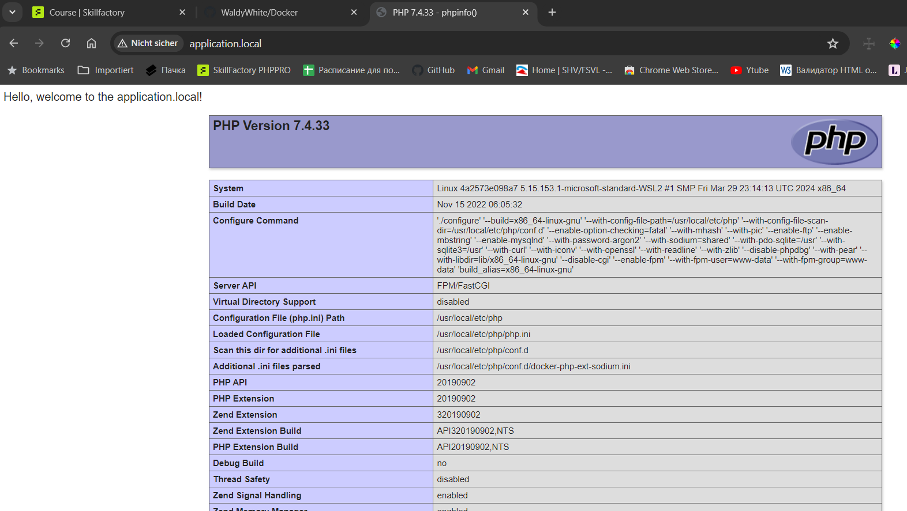

## Docker

Перейдите в браузере по адресу

  http://application.local
 
 Вы должны увидеть приветствие и страницу phpinfo.

#### Windows:
Откройте C:\Windows\System32\drivers\etc\hosts и добавьте строку:

plaintext
Code kopieren

    127.0.0.1 application.local

#### Linux/MacOS:
Откройте /etc/hosts и добавьте строку:

plaintext
Code kopieren

    127.0.0.1 application.local

### compose файл

    version: '3'

    services:
    nginx:
        build:
        context: ./nginx
        container_name: nginx
        ports:
        - "80:80"
        volumes:
        - ./code:/var/www/html
        networks:
        - app-network

    php:
        build:
        context: ./php
        container_name: php
        volumes:
        - ./code:/var/www/html
        - ./php/php.ini:/usr/local/etc/php/php.ini
        networks:
        - app-network

    db:
        image: mysql:5.7
        container_name: db
        environment:
        MYSQL_ROOT_PASSWORD: root
        MYSQL_DATABASE: appdb
        MYSQL_USER: user
        MYSQL_PASSWORD: password
        ports:
        - "3306:3306"
        volumes:
        - dbdata:/var/lib/mysql
        - ./mysql/my.cnf:/etc/mysql/my.cnf
        networks:
        - app-network

    networks:
    app-network:
        driver: bridge

    volumes:
    dbdata:

